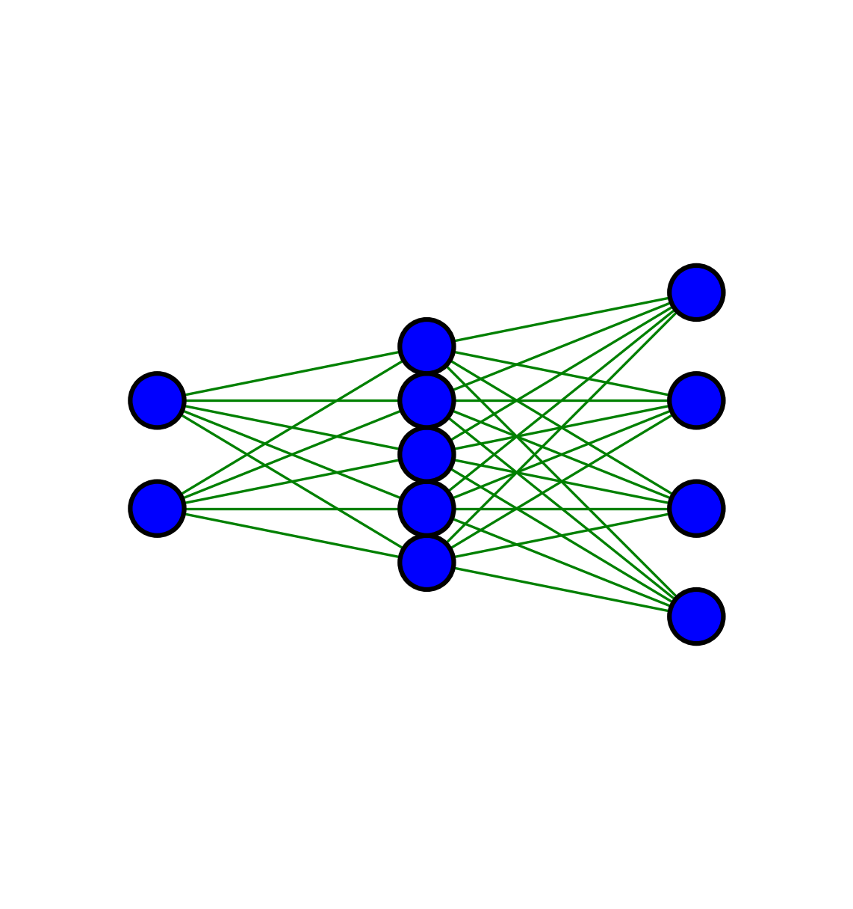

# Neural Network Diagram Drawer

A Python function to draw fully connected (neural) network diagrams using Matplotlib. This tool allows you to visualize neural network architectures with control over node and layer spacings, colors, and supports high-resolution outputs with transparent backgrounds. It's ideal for presentations, publications, or web content.

## Features

- **Customizable Node and Layer Spacing**: Specify vertical spacing between nodes and horizontal spacing between layers, either as single values or lists for per-layer customization.
- **Color Customization**: Customize node fill color, node border color, and edge (connection) color.
- **High-Resolution Output**: Generate high-resolution images suitable for print and digital media.
- **Transparent Background**: Output images with transparent backgrounds in multiple formats (`PNG`, `PDF`, `SVG`).
- **Centered Layout**: The network diagram is perfectly centered both horizontally and vertically.
- **Flexible Network Structure**: 

## Installation

Ensure you have `matplotlib` installed:

```
pip install matplotlib
```

## Example

```python
import matplotlib.pyplot as plt

# Define your network structure
network_structure = {1: 2, 2: 5, 3: 4}


fig, ax = plt.subplots(figsize=(5, 5), dpi=300)
ax.set_aspect('equal')
ax.axis('off')
fig.patch.set_alpha(0)  

# Set figure background to transparent

draw_neural_network(ax,
                    network_structure,
                    node_color='blue',
                    edge_color='green',
                    layer_spacing=0.5, # optionally pass list of layer spacings between layers
                    node_spacings=[0.2, 0.1, 0.2], # optionally pass list of node spacings for each layer
                    )

# Save the figure to multiple file formats with transparent background
file_formats = ['png', 'pdf', 'svg']
for file_format in file_formats:
    plt.savefig(
        f'neural_network_diagram.{file_format}',
        format=file_format,
        dpi=300,
        bbox_inches='tight',
        transparent=True
    )
```

# Output
<p align="center">
  
</p>